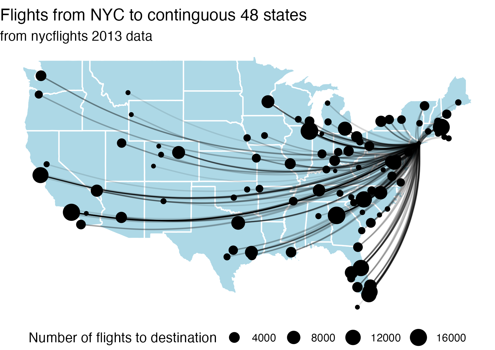

## Load packages

```{r}

```

## Flight map

We're going to re-receate the image below.

*Note, to view the image in your html, download the "flights_map.png" file and place it in an images subfolder of your STAT_7500 folder.*



Some starter code is provided below for creating a basic US map.

```{r}
#| eval: false

state <- map_data("state")

ggplot() + 
  geom_polygon(data = state, 
               aes(x = long, y = lat, group = group),
               fill = 'lightblue', color = "white") +
  theme_void() +
  coord_fixed(1.3)
```

Adding on the flight trajectories will require some creative data wrangling. You can use a `geom_curve()` layer to create the flight curves; the above plot has `curvature = 0.2`. Note, you can use different datasets and aesthetic mappings in different `geom` layers (see `geom_polygon()` layer above).

**Start by thinking through what we WANT - what form does the dataset need to be in to create the visualization above? What rows & columns do we need?**

```{r}

```

## (For Later) UCBerkley Admissions

```{r}

```

## Reshaping and working with counts

### 1. One row per patient

Run the code below to create `patients`.

```{r}
patients <- tribble(
  ~patient_id, ~measurement_time_, ~systolic_bp,
  "P1",        "Morning",          120,
  "P1",        "Noon",             115,
  "P1",        "Evening",          123,
  "P2",        "Morning",          118,
  "P2",        "Evening",          121
)
patients
```


Before coding, predict the number of rows and columns if we reshape
the data to have **one row per patient** and a separate column for
each measurement time.

Then reshape the data. Explain what the resulting `NA` means.
Would replacing it with 0 be appropriate?

```{r}

```

### D1 athletics opinions

A survey asked US adults whether changes in Division I college
athletics had a positive, negative, or neutral impact, or whether
they were unsure. The following data summarize responses by age.

```{r}
survey_counts <- tribble(
  ~age,    ~opinion,            ~n,
  "18-44", "Very positive",     78,
  "18-44", "Somewhat positive", 176,
  "18-44", "Neutral",           162,
  "18-44", "Somewhat negative", 50,
  "18-44", "Very negative",     36,
  "18-44", "Unsure",            197,
  "45+",   "Very positive",     41,
  "45+",   "Somewhat positive", 121,
  "45+",   "Neutral",           186,
  "45+",   "Somewhat negative", 146,
  "45+",   "Very negative",     97,
  "45+",   "Unsure",            210
) |>
  mutate(opinion = factor(opinion, levels = c(
    "Very positive", "Somewhat positive", "Neutral",
    "Somewhat negative", "Very negative", "Unsure"
  )))
survey_counts
```


**Each row represents an age–opinion combination; `n` records
the number of respondents in that combination.**

1. Calculate the count and proportion for each opinion category **across both age groups combined**.

Before coding: What should the denominator be? Why would
`count(opinion)` alone give the wrong counts?

Return one row per opinion, with columns for the opinion, count, and proportion.

```{r}

```

**Conditional proportions of opinion based on age**: Calculate the proportions of individuals who are Very positive, Somewhat positive, Neutral, Somewhat negative, Very negative, and Unsure

+ among those who are 18-44 years old and
+ among those who are 45+ years old


```{r}

```

Finally, adapt the code above to display your proportions as a 6x3 data frame where the first column lists the opinion category, and the 2nd and 3rd columns give the proportions for the 18-44 and 45+ age categories, respectively.